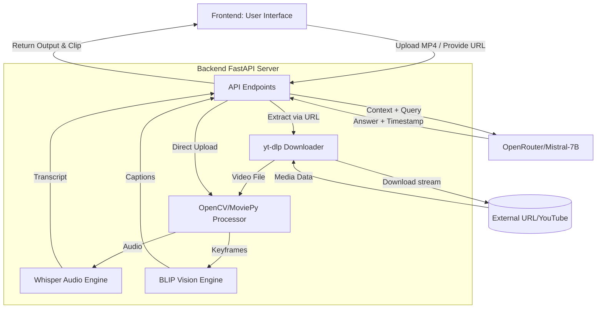
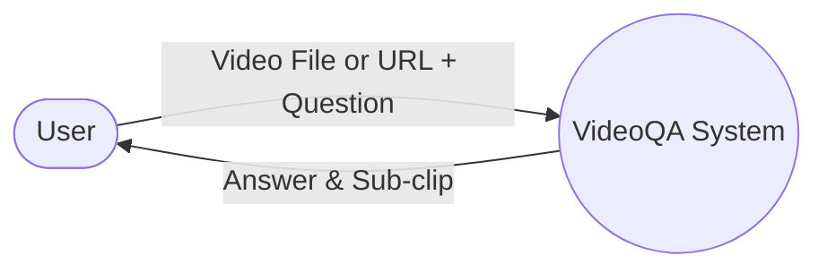
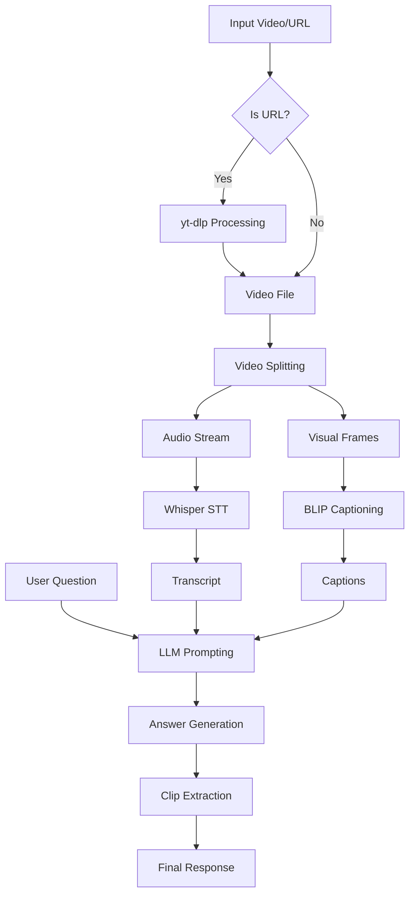
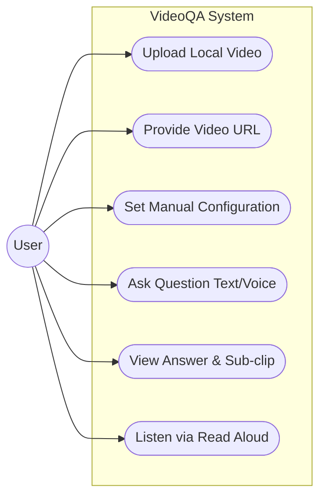
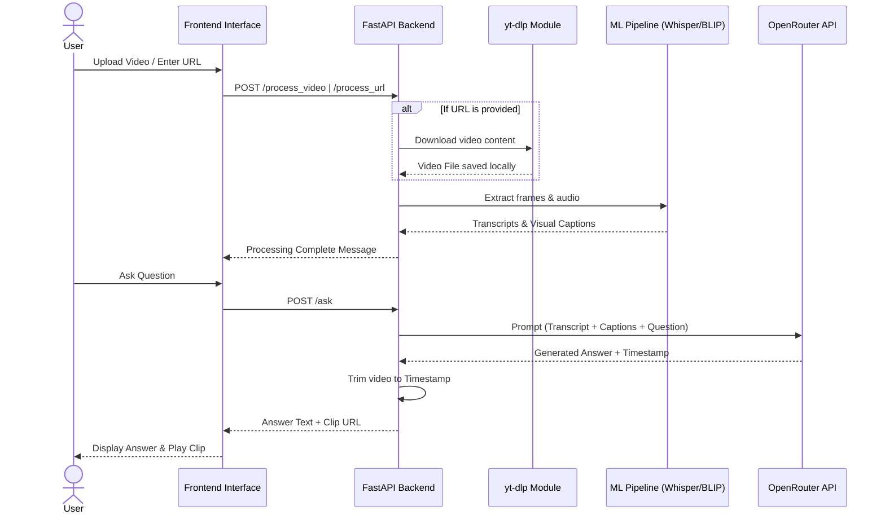

## Chapter 3: System Architecture and Design

### 3.1 Overview of the Proposed System
The proposed VideoQA system operates on a client-server architecture. The user uploads a video or provides a video URL via the frontend web interface, which is sent to the FastAPI backend. For URLs, the backend uses `yt-dlp` to download the video. It then processes the video using Whisper (for audio) and BLIP (for visual keyframes), compiles a comprehensive context prompt, and uses the Mistral-7B LLM to answer subsequent user questions. 

### 3.2 System Architecture Diagram
*(A block diagram representing the interaction between the User Interface, FastAPI Server, yt-dlp Video Downloader, Whisper Model, BLIP Model, OpenCV Video Processor, and OpenRouter LLM API.)*

### 3.3 Backend Components Description
*   **FastAPI Web Server:** Handles RESTful API requests.
*   **Video Downloader (yt-dlp):** Extracts and downloads videos from provided URLs.
*   **Video Processor (OpenCV/MoviePy):** Extracts an optimal number of keyframes and generates answer clips.
*   **Speech-to-Text Engine:** Utilizes OpenAI's `whisper-medium` model.
*   **Vision Engine:** Utilizes Salesforce's `BLIP-large` for image captioning.
*   **LLM Controller:** Manages API calls to OpenRouter (using `mistralai/mistral-7b-instruct`) for reasoning.

### 3.4 Frontend Components Description
*   **User Interface (HTML/CSS):** A premium, responsive design.
*   **Client Logic (Vanilla JS - app.js & api.js):** Handles API interactions, state management, and updates the DOM.
*   **Accessibility Modules:** Implements browser-based Speech Recognition (Voice Input) and Speech Synthesis (Read Aloud).

### 3.5 Data Flow Diagram (DFD)
**Level 0:**

**Level 1:**

### 3.6 Use Case Diagram
*   **Actor:** User
*   **Use Cases:** Upload Video, Provide Video URL, Set Manual Selection (Frames/Time), Ask Question via Text, Ask Question via Voice, View Answer, Play Answer Clip, Listen to Answer (Read Aloud).

### 3.7 System Workflow
1. User uploads a video or submits a video URL.
2. If a URL is provided, the system downloads the video using `yt-dlp`.
3. System extracts audio and transcribes it.
4. System extracts keyframes and generates captions.
5. User asks a question.
6. System prompts the LLM with the transcript, captions, and question.
7. LLM generates an answer and identifies relevant timestamps.
8. System cuts a video clip based on the timestamp and returns it to the UI.

